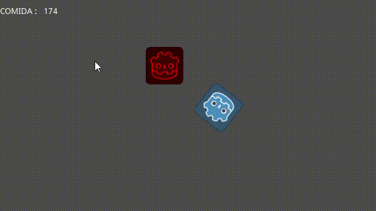

# Food-Finder

This is a Simple food finder Autonomous Agent made for a assigment in my IF684EC class - Smart Systems

## Demo

## Requiremnets

For run this project you will need to install [Godot](https://godotengine.org/download). The current version used by the project is the version 3.2.1.

## How to run

Open Godot, wait for the godot manage project then click in the import button and select the `project.godot` in `project/project.godot` path. Then lauch the project and press the play button in the top-right corner of the editor to see all running.

## Scripts

All scripts are in the `project/scripts` path. 